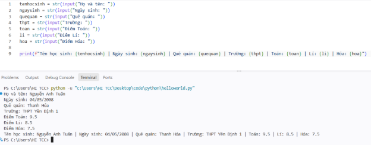
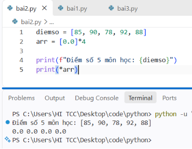
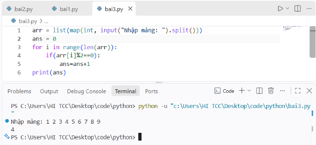

1. Biến, kiểu dữ liệu

   1\. 1. Cách khai báo: tên\_biến = giá\_trị

   Ví dụ:

   age = 25

   height = 1.75

   name = “Nguyễn Anh Tuấn”

   is\_student = True;

   daiso, giaitich, nhapmoncntt\_tt = 2.5, 2.5, 3.0 #

   1\.2. Các kiểu dữ liệu:

   |Số nguyên|int|
   | :- | :- |
   |Số thực|float|
   |Xâu|str|
   |Logic|bool|
   |Giá trị rỗng|NoneType|

   1\.3. Kiểm tra và ép kiểu dữ liệu

   1\.3.1. Kiểm tra kiểu dữ liệu:

   a = 100

   print(type(a))  # Kết quả: <class 'int'>

   1\.3.2. Ép kiểu dữ liệu:

   # Chuyển chuỗi thành số

   num\_str = "123"

   num\_int = int(num\_str) # 123 (int) 

   num\_float = float(num\_str) # 123.0 (float) 

   # Chuyển số thành chuỗi 

   age = 20 

   age\_str = str(age) # "20" (str)

1. Nhập xuất
   1. Xuất dữ liệu

Dùng print:

name = "Python"

version = 3.12

score = 9.5678

\# Xuất cơ bản

print("Xin chào!")

\# Xuất sử dụng f-string và định dạng số thập phân

print(f"Ngôn ngữ: {name} | Phiên bản: {version}")

print(f"Điểm số: {score:.2f}")  # Lấy 2 chữ số thập phân -> 9.57

Mở rộng: Xuất sang txt, excel, ... (cái này dùng thư viện, basic chưa cần)

1. Nhập dữ liệu
   1. Nhập và ép kiểu dữ liệu:

\# Nhập chuỗi

name = input("Nhập tên của bạn: ")

\# Nhập số nguyên (int)

age = int(input("Nhập tuổi: "))

\# Nhập số thực (float)

height = float(input("Nhập chiều cao (m): "))

print(f"Xin chào {name}, {age} tuổi, cao {height}m.")

Nhập nhiều giá trị trên cùng 1 dòng:

\# Nhập nhiều chuỗi (ví dụ nhập: Hà Nội TP.HCM Đà Nẵng)

city1, city2, city3 = input("Nhập 3 thành phố: ").split()

\# Nhập dãy số và chuyển thành danh sách số nguyên (ví dụ nhập: 5 10 15 20)

numbers = list(map(int, input("Nhập các số nguyên cách nhau bởi khoảng trắng: ").split()))

print("Danh sách vừa nhập:", numbers)

**Bài 1:** Nhập tên học sinh, ngày sinh, quê quán, tên trường THPT, điểm thi đại học toán, lí, hóa:

1. Mảng
   1. Khai báo mảng

      # Cách 1: Khai báo mảng rỗng

      arr = []

      # Cách 2: Khai báo mảng có sẵn các giá trị

      arr = [5, 10, 15, 20, 25]

      # Cách 3: Khai báo mảng gồm n phần tử mang giá trị mặc định

      n=5

      arr = []\*n

   1. Nhập mảng từ bàn phím

      Nhập từng phần từ trên từng dòng:

      n = int(input("Nhập số lượng phần tử n = "))

      arr = []

      for i in range(n):

      `    `val = int(input(f"Nhập phần tử thứ {i}: "))

      `    `arr.append(val)

      Nhập tất cả phần tử trên 1 dòng:

      # Nhập chuỗi -> tách theo dấu cách (split) -> chuyển thành số nguyên (map) -> tạo mảng (list)

      arr = list(map(int, input("Nhập các phần tử cách nhau bởi dấu cách: ").split()))

   1. Xuất mảng ra màn hình

print(arr); print(\*arr); for x in arr: print(x, end=" ")

1. Truy cập theo chỉ số

   arr[index]

**Bài 2: Khai báo Mảng**

\- Khai báo một mảng chứa điểm số 5 môn học (85, 90, 78, 92, 88).

\- Khai báo một mảng chứa 4 giá trị số thực double rỗng (mang giá trị mặc định là 0.0).

**Bài 3: Phần tử chẵn**

\- Cho mảng A gồm n số nguyên dương, đếm số lượng phần tử chẵn của mảng.

1. If else/ switch case
   1. Cấu trúc if ... elif ... else
   1. Toán tử 3 ngôi <True> if <Điều kiện> else <False>
   1. Kết hợp nhiều điều kiện (and, or, not)
   1. match ... case
1. For/ while
   1. for

      # Duyệt qua các phần tử trong danh sách (List)

      fruits = ["táo", "chuối", "cam"]

      for fruit in fruits:

      `    `print(fruit)

      # Duyệt theo chuỗi số với hàm range(start, stop, step)

      for i in range(1, 5):

      `    `print(i)  # In ra từ 1 đến 4

   1. while

      count = 1

      while count <= 3:

      `    `print(f"Lần lặp thứ {count}")

      `    `count += 1  # Bắt buộc cập nhật biến điều kiện để tránh lặp vô tận

   1. Các câu lệnh điều khiển trong vòng lặp

      break; continue;

1. Hàm

   Cú pháp: def tên\_hàm(tham số 1, tham số 2, ...): return (nếu có)

**Bài 4: <https://marisaoj.com/problem/40>**

1. Collection/ Container
   1. List

|**Thao tác**|**Python**|
| :-: | :-: |
|**Thêm phần tử**|
append(val)

insert(pos, val)

extend(): Nối thêm toàn bộ phần tử của một list/ tập hợp khác vào cuối list
|
|**Truy cập phần tử**|list[...]|
|**Sửa phần tử**|list[...] = ...|
|**Xóa toàn bộ**|list.clear()|
|**Xóa phần tử theo chỉ số/ giá trị**|
list.pop(index)

list.remove(val): Xóa giá trị đầu tiên bằng val
|
|**Lấy kích thước**|len(list)|
|**Sắp xếp tăng dần từ i đến j**|list.sort()|

**Bài 5:**

**Truy vấn mở rộng trên Mảng Động**

Cho một mảng gồm N số nguyên (đánh số chỉ số từ 1 đến N) và Q truy vấn. Bạn cần xử lý lần lượt Q truy vấn thuộc một trong bốn loại sau:

**Loại 0 (0 val):** Thêm số nguyên val vào cuối mảng (kích thước mảng tự động tăng thêm 1).

**Loại 1 (1 i val):** Thay đổi giá trị phần tử tại chỉ số i thành val (1≤i≤kích thước mảng hiện tại).

**Loại 2 (2 L R):** Sắp xếp tăng dần các phần tử từ chỉ số L đến R (i≤L≤R≤kích thước mảng hiện tại).

**Loại 3 (3):** In toàn bộ phần tử của mảng hiện tại ra màn hình trên một dòng, các số cách nhau bởi dấu khoảng trắng.

**Dữ liệu vào (Input)**

- Dòng thứ nhất chứa 2 số nguyên N, Q (1≤N,Q≤1000).
- Dòng thứ hai chứa N số nguyên mô tả mảng ban đầu.
- Q dòng tiếp theo, mỗi dòng biểu diễn một truy vấn thuộc 1 trong 4 dạng trên.

**Dữ liệu ra (Output)**

- Ứng với mỗi truy vấn Loại 3, in ra trạng thái mảng trên một dòng.

**Ví dụ**

|**Input**|**Output**|
| :-: | :-: |
|
4 6

5 2 8 1

0 3

2 2 5

3

1 1 9

0 7

3
|
5 1 2 3 8

9 1 2 3 8 7
|

**Python:**

1. Dict
1. dict

Lưu theo cặp key-value

Duy trì thứ tự theo thứ tự chèn, chèn trước đứng trước

my\_dict = {"apple": 5, "banana": 2} my\_dict["orange"] = 8 # Thêm phần tử O(1) print(my\_dict["apple"]) # Truy xuất O(1)

1. SortedDict

Thư viện: sortedcontainers

from sortedcontainers import SortedDict

s\_dict = SortedDict()

s\_dict["banana"] = 2

s\_dict["apple"] = 5

s\_dict["orange"] = 8

\# Key tự động sắp xếp: ['apple', 'banana', 'orange']

for key, value in s\_dict.items():

`    `print(key, value)

**Bài 6:**

**Mảng cộng dồn động**

Giới hạn thời gian: 1000 ms

Giới hạn bộ nhớ: 256 MB

Cho một mảng A gồm n phần tử số nguyên. Bạn cần xử lý q truy vấn thuộc một trong ba loại:

- 1 x: Thêm giá trị x vào cuối của mảng A.
- 2: Xóa giá trị cuối cùng của mảng A.
- 3 l r: Tính tổng phần tử từ có chỉ số từ l đến r, chỉ số của mảng bắt đầu từ 1.

**Input**

- Dòng đầu tiên gồm hai số nguyên n,q.
- Dòng thứ hai gồm n số nguyên Ai.
- q dòng tiếp theo, mỗi dòng gồm một truy vấn theo định dạng đã nêu trên.

**Output**

- In ra một số nguyên là đáp án cho mỗi truy vấn loại 3.

**Điều kiện**

- 1≤n,q≤105.
- 1≤x≤109.
- 1≤l≤r≤|A| với |A| là độ dài của mảng A lúc truy vấn này xuất hiện.

**Ví dụ**

Input

5 4

1 2 3 4 5

1 6

3 1 6

2

3 2 3

Copy

Output:

21

5

**Python:**

1. Set và Counter
   1. Set

\# Tạo set

s = {1, 2, 3, 3, 4}  # Kết quả: {1, 2, 3, 4} (tự loại bỏ phần tử trùng)

\# Thêm và xóa phần tử

s.add(5)         # Thêm phần tử

s.remove(2)      # Xóa phần tử 2 (báo lỗi KeyError nếu không tồn tại)

s.discard(10)    # Xóa phần tử 10 (không báo lỗi nếu không tồn tại)

\# Kiểm tra sự tồn tại - O(1)

if 3 in s:

`    `print("3 có trong set")

\# Các phép toán tập hợp

a = {1, 2, 3}

b = {3, 4, 5}

print(a | b)  # Hợp (Union): {1, 2, 3, 4, 5}

print(a & b)  # Giao (Intersection): {3}

print(a - b)  # Hiệu (Difference): {1, 2}

print(a ^ b)  # Hiệu đối xứng (Symmetric Difference): {1, 2, 4, 5}

1. Counter

from collections import Counter

\# Tạo multiset từ danh sách

ms = Counter([1, 1, 2, 3, 3, 3, 4])

print(ms)  # Kết quả: Counter({3: 3, 1: 2, 2: 1, 4: 1})

\# Thêm và giảm phần tử

ms[1] += 1        # Thêm một phần tử 1 vào multiset

ms.update([3, 5]) # Thêm nhiều phần tử

ms.subtract([3])  # Giảm 1 lần xuất hiện của phần tử 3

\# Kiểm tra số lần xuất hiện

print(ms[3])  # Trả về số lượng phần tử 3

print(ms[99]) # Trả về 0 nếu không tồn tại (không báo lỗi)

\# Duyệt qua tất cả các phần tử (bao gồm lặp)

all\_elements = list(ms.elements())

print(all\_elements)  # [1, 1, 1, 2, 3, 3, 3, 4, 5]

\# Phép toán tập hợp multiset

c1 = Counter(a=3, b=1)

c2 = Counter(a=1, b=2)

print(c1 + c2)  # Cộng số lượng: Counter({'a': 4, 'b': 3})

print(c1 & c2)  # Lấy min số lượng: Counter({'a': 1, 'b': 1})

print(c1 | c2)  # Lấy max số lượng: Counter({'a': 3, 'b': 2})

1. Deque

Khai báo: dq = deque()

|Thao tác|Deque|
| :- | :- |
|Thêm phần tử vào cuối cùng|dq.append(x)|
|Thêm phần tử vào đầu tiên|dq.appendleft(x)|
|Xóa phần tử cuối cùng|dq.pop()|
|Xóa phần tử đầu tiên|dq.popleft()|
|Lấy phần tử đầu tiên|dq[0]|
|Lấy phần tử cuối cùng|dq[-1]|
|Kiểm tra rỗng hay không|not dq|

from collections import deque

\# Khởi tạo deque

dq = deque([20, 30])

\# Thêm vào 2 đầu

dq.append(40)       # Thêm vào bên phải (cuối): [20, 30, 40]

dq.appendleft(10)   # Thêm vào bên trái (đầu): [10, 20, 30, 40]

\# Xem phần tử 2 đầu

print("Front:", dq[0])   # Output: 10

print("Back:", dq[-1])   # Output: 40

\# Xóa từ 2 đầu

left = dq.popleft() # Xóa bên trái -> 10

right = dq.pop()    # Xóa bên phải -> 40

print("Lưới deque còn lại:", dq)  # Output: deque([20, 30])
